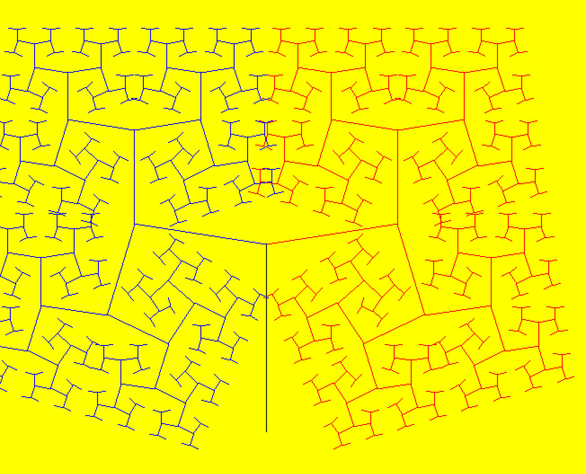

# Experimenting PyGame

Tutorial:

https://nerdparadise.com/programming/pygame

`game_1.py`

Draws a rectangle.

`game_2.py`

Color changes with Space key.
Moves the rectangle with arrow keys.

`game_3.py`

Moves an image with arrow keys

`game_4.py`

Sample fractal using recursion.

`game_5.py`

creates a fractal tree

`game_6.py`

Creates a visual of building a fractal tree.

`maze_generation.py`

Generates a Maze.

`gif_hilbert.py`

Generate a gif of a hilbert curve
